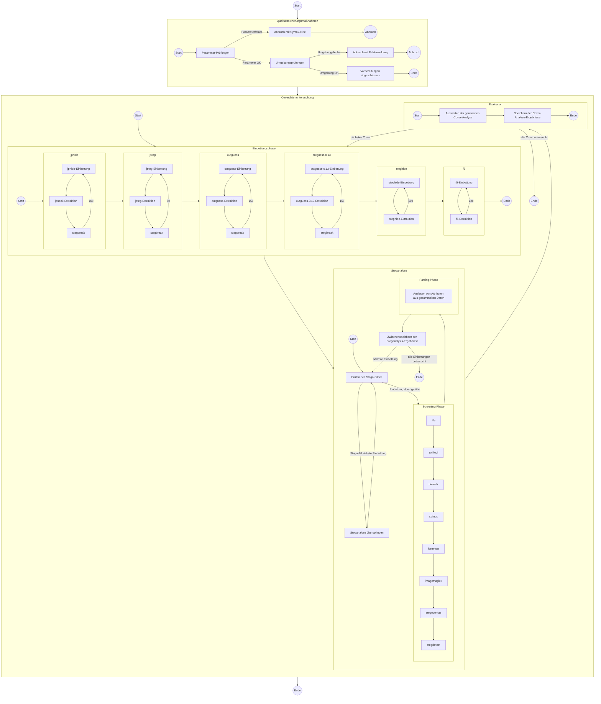

# SMKITS5 / Dokumentation / Ablaufdiagramm des Testprotokolls

## Anmerkungen
| Phase | Anmerkungen |
| --- | --- |
| Qualitätssicherungsmaßnahmen | Prüfung der Docker-Umgebung; ImageMagick-Installation; Existenz der angegebenen Cover-Daten; Zählen der verfügbaren JPG-Dateien im Bildtestset; Herunterladen der Test-Einbettungsdaten, falls diese nicht vorhanden sind |
| Einbettungsphase | Einbetten und Extrahieren der Test-Einbettungsinhalte nach Testprotokoll |
| Steganalyse | fehlerhafte Einbettungen (Stego-Bild ist leer) werden übersprungen, da leere Dateien keinen Mehrwert für weitere Analysen bieten; relevante Attributierungsmerkmale (Tabellen oben) werden aus den beim Screening generierten Daten geparsed und in CSV gespeichert |
| Evaluation | bei Steganalyse erstellte CSV wird ausgewertet; Endergebnisse werden in finalen Output geschrieben |
## altes Diagramm (Entwurf)

