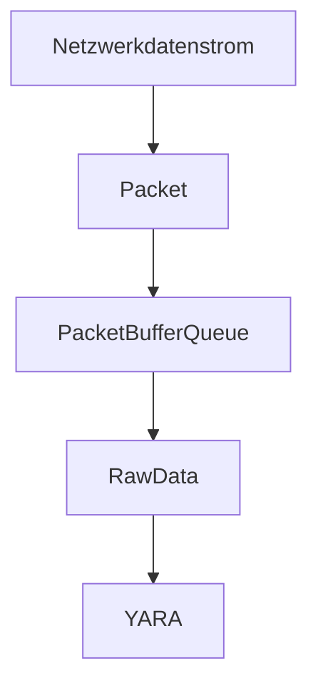

# TAITS0
## Industrie-Ransom 2.0 - Evaluation der Anwedung von YARA zur Erkennung netzwerkbasierter Ransomware
...
<!---
| Projektstruktur | Referenz |
| --- | --- |
| Abschlussbericht | [./smkits5-stegodetect.pdf](./smkits5-stegodetect.pdf) |
-->
## Aufgabenstellung
- Thema: Untersuchung von netzwerkbasierter Ransomware im industriellen Umfeld (Modbus) und Systematisierung mit YARA
- Zentrale Frage: Nutzung und Demonstration netzwerkabsierter Ransomware mit minimalen Rechten: Möglichkeiten und Grenzen
- [X] [KW46/47] Einarbeitung in Tools/Technologien
    - [X] YARA
    - [X] Scapy
    - [X] Modbus
- [ ] [KW48-52] Aufbau eines eigenen Demonstrators:
    - [X] Erzeugen von Samples/Mitschnitten/Evaluierung
    - [ ] Erzeugung von YARA-Patterns
    - [ ] Evaluierung, ob diese YARA-Patterns zur Detektion verwendbar sind
- [ ] [KW01/02] Bericht schreiben: Können YARA-Patterns netzwerkbasierte Ransomware mit verdeckten Funktionen beschreiben?
    - [ ] Wenn ja, wie?
    - [ ] Wenn nein, was fehlt und was für Anpassungen wären nötig?
## Notizen
### Einleitung
- netzwerkbasierte Ransomware mit verdeckten Funktionen sind eine spezielle, neue Art von Schadsoftware, Modbus wird häufig verwendet (siehe vorgegebene Paper bla bla)
- Tools/Technologien: YARA Scapy Wireshark
- Thema wird gefördert durch das Projekt SMARTEST2
### Methodik
- Scapy zeichnet Netzwerkdatenstrom auf
- (aktuelle) Pakete werden in einer Queue gehalten
- Queue wird in Rohdaten gewandelt
- Regeln werden auf Rohdaten angewandt
- Queue wird in Rohdaten gewandelt
- Regeln werden auf Rohdaten angewandt

### Erkenntnisse
- verschlüsselter Traffic kann nicht detektiert werden, da die (u.u. schädlichen) Anweisungen nicht lesbar sind; als Warden wäre allerdings stets die Möglichkeit gegeben, den Netzwerkverkehr zu überwachen
### Referenzen
- YARA: https://github.com/VirusTotal/yara
- YARA Regeln: https://yara.readthedocs.io/en/stable/writingrules.html
- YARA Python: https://github.com/VirusTotal/yara-python
- ENISA Threat Landscape for Ransomware Attacks https://www.enisa.europa.eu/publications/enisa-threat-landscape-for-ransomware-attacks/@@download/fullReport
- 2 vorangegangene Arbeiten von Studenten (intern)
- ICS datasets: https://gitti.cs.uni-magdeburg.de/klamshoeft/ics-datasets
- weitere Referenzen in Mail von Robert
