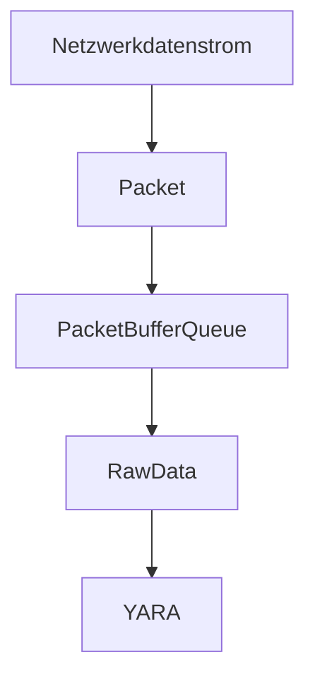

# TAITS0
## Industrie-Ransom 2.0 - Evaluation der Anwendung von YARA zur Erkennung netzwerkbasierter Ransomware
...
<!---
| Projektstruktur | Referenz |
| --- | --- |
| Abschlussbericht | [./smkits5-stegodetect.pdf](./smkits5-stegodetect.pdf) |
-->
## Aufgabenstellung
- Thema: Untersuchung von netzwerkbasierter Ransomware im industriellen Umfeld (Modbus) und Systematisierung mit YARA
- Zentrale Frage: Nutzung und Demonstration netzwerkabsierter Ransomware mit minimalen Rechten: Möglichkeiten und Grenzen
- [X] [KW46/47] Einarbeitung in Tools/Technologien
    - [X] YARA
    - [X] Scapy
    - [X] Modbus
- [ ] [KW48-52] Aufbau eines eigenen Demonstrators:
    - [X] Erzeugen von Samples/Mitschnitten/Evaluierung
    - [ ] Erzeugung von YARA-Patterns
    - [ ] Evaluierung, ob diese YARA-Patterns zur Detektion verwendbar sind
- [ ] [KW01/02] Bericht schreiben: Können YARA-Patterns netzwerkbasierte Ransomware mit verdeckten Funktionen beschreiben?
    - [ ] Wenn ja, wie?
    - [ ] Wenn nein, was fehlt und was für Anpassungen wären nötig?
## Notizen
### Einleitung
- netzwerkbasierte Ransomware mit verdeckten Funktionen sind eine spezielle, neue Art von Schadsoftware, Modbus wird häufig verwendet (siehe vorgegebene Paper bla bla)
- Tools/Technologien: YARA Scapy Wireshark
- Thema wird gefördert durch das Projekt SMARTEST2
### Methodik
- Scapy zeichnet Netzwerkdatenstrom auf
- (aktuelle) Pakete werden in einer Queue gehalten
- Queue wird in Rohdaten gewandelt
- Regeln werden auf Rohdaten angewandt
- Queue wird in Rohdaten gewandelt
- Regeln werden auf Rohdaten angewandt

### Erkenntnisse
| Detektion/Angriffsvektor | Kurzbeschreibung | Erkenntnis | Aufzeichnung | YARA-Regel | Quelle |
| --- | --- | --- | --- | --- | --- |
| Modbus query-flooding I | *i* von den *n* letzten Paketen aus Netzwerkdatenstrom sind vom selben Pattern | ✅ detektierbar | [[PCAP](./io/CRITIS18/critis18-eth2dump-modbusQueryFlooding1m-0,5h_1.pcap)] | [[YARA](./io/yara_rules/modbus_query_flooding.yara)] [`-pbs=3`] | [[CRITIS18](https://doi.org/10.1007/978-3-030-05849-4_19)] [[ICSDS](https://gitti.cs.uni-magdeburg.de/klamshoeft/ics-datasets)] |
| Modbus query-flooding II | Zeitintervall zwischen den letzten zwei Paketen vom selben Pattern | ✅ detektierbar | [[PCAP](./io/CRITIS18/critis18-eth2dump-clean-0,5h_1.pcap)] | [[YARA](./io/yara_rules/modbus_query_flooding.yara)] [`-pbs=3`] | [[CRITIS18](https://doi.org/10.1007/978-3-030-05849-4_19)] [[ICSDS](https://gitti.cs.uni-magdeburg.de/klamshoeft/ics-datasets)] |
| OPCUA value-range | Auslesen und Abgleichen von konkreten Werten aus einzelnen Netzwerkpaketen | ✅ detektierbar | [[PCAP](./io/KochvorgangMartin/ContainmentPi_Kochvorgangbis100Grad.pcapng)] | [[YARA](./io/yara_rules/opcua_kochvorgang.yara)] [`-pbs=1`] | [[KVGMT](./io/KochvorgangMartin/)] |
| OPCUA value-difference | Auslesen und Verrechnen von konkreten Werten aus mehreren Netzwerkpaketen | ✅ detektierbar | [[PCAP](./io/KochvorgangMartin/ContainmentPi_Kochvorgangbis100Grad.pcapng)] | [[YARA](./io/yara_rules/opcua_kochvorgang.yara)] [`-pbs=50`]| [[KVGMT](./io/KochvorgangMartin/)] |
| OPCUA invalid write-value | Unmögliche Wertefilterung | ✅ detektierbar | [[pcap](./io/LaborRansomware-Angriff-WriteValue)] | [[YARA](./io/yara_rules/opcua_labransom.yara)] [`-pbs=1`] | [[src](https://cloud.ovgu.de/s/F4HyWsXF25SSdEd?path=%2FNetzwerk-Ransomware-Angriffe%2FLaborRansomware-Angriff-WriteValue)] (2. Mail Robert, Uni-Cloud) |
|  | Sign |  | [[pcap](./io/Ransomware-Angriff-ImSignModus)] |  | [[src](https://cloud.ovgu.de/s/F4HyWsXF25SSdEd?path=%2FNetzwerk-Ransomware-Angriffe%2FRansomware-Angriff-ImSignModus)] (2. Mail Robert, Uni-Cloud) |
|  | SignEncrypt |  | [[pcap](./io/Ransomware-Angriff-ImSignAndEncryptModus)] |  | [[src](https://cloud.ovgu.de/s/F4HyWsXF25SSdEd?path=%2FNetzwerk-Ransomware-Angriffe%2FRansomware-Angriff-ImSignAndEncryptModus)] (2. Mail Robert, Uni-Cloud) |
|  | Prosys |  | [[pcap](./io/Prosys-2023-12)] |  | [[src](https://cloud.ovgu.de/s/F4HyWsXF25SSdEd?path=%2FProsys-2023-12)] (2. Mail Robert, Uni-Cloud) |
|  | SecureChannel |  | [[pcap](./io/LaborRansomware-Angriff-SCID)] |  | [[src](https://cloud.ovgu.de/s/F4HyWsXF25SSdEd?path=%2FNetzwerk-Ransomware-Angriffe%2FLaborRansomware-Angriff-SCID)] (2. Mail Robert, Uni-Cloud) |
| Modbus-LSB-Stego | Entropie-Validierung von Modbus-Registerwerten |  | [[PCAP](./io/Lemay/lemay-channel_4d_12s.pcap)] |  | [[LeF16](https://doi.org/10.1109/SYSCON.2016.7490631)] [[ICSDS](https://gitti.cs.uni-magdeburg.de/klamshoeft/ics-datasets)] |
|  | mitm |  | [[PCAP](./io/CRITIS18/critis18-eth2dump-mitm-change-1m-0,5h_1.pcap)] |  | [[CRITIS18](https://doi.org/10.1007/978-3-030-05849-4_19)] [[ICSDS](https://gitti.cs.uni-magdeburg.de/klamshoeft/ics-datasets)] |
- verschlüsselter Traffic kann nicht detektiert werden, da die (u.u. schädlichen) Anweisungen nicht lesbar sind; als Warden wäre allerdings stets die Möglichkeit gegeben, den Netzwerkverkehr zu überwachen

### zu klärende Fragestellungen
- Grenzen von Modulen: prinzipiell kann mit C turing-vollständig gearbeitet werden --> Was ist aber wirklich praktikabel?
- Kann YARA die Abwesenheit von Paketen detektieren?
- mitm/pingFlood/tcpSYNFlood (Critis18-Testset) detektierbar?
- LSB-Stego in Modbus-Registern (Lemay-Testset) detektierbar?
### Referenzen
- YARA: https://github.com/VirusTotal/yara
- YARA Regeln: https://yara.readthedocs.io/en/stable/writingrules.html
- YARA Python: https://github.com/VirusTotal/yara-python
- ENISA Threat Landscape for Ransomware Attacks https://www.enisa.europa.eu/publications/enisa-threat-landscape-for-ransomware-attacks/@@download/fullReport
- 2 vorangegangene Arbeiten von Studenten (intern)
- ICS datasets: https://gitti.cs.uni-magdeburg.de/klamshoeft/ics-datasets
- https://gitti.cs.uni-magdeburg.de/klamshoeft/ics-datasets/-/tree/main/Modbus/Lemay/dataset?ref_type=heads
- weitere Referenzen in Mail von Robert
